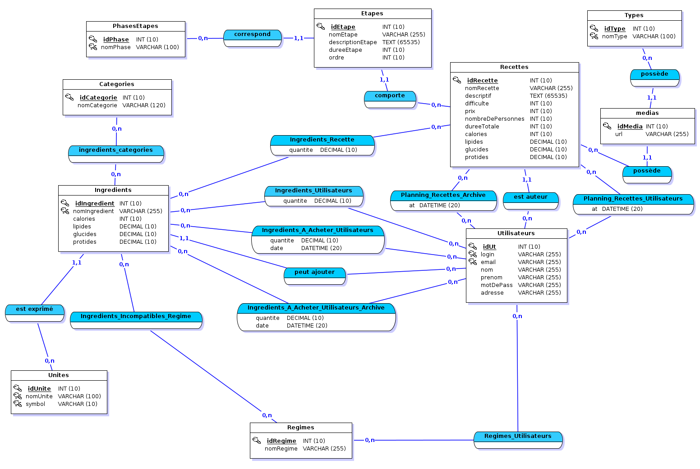

# Implementation d'une base de données d'un site de recettes de cuisine

> Projet réalisé dans le cadre de l'UE de base de données et programmation web
> de la troisième année de licence d'informatique, avec Oracle SQL.

## Modélisation

